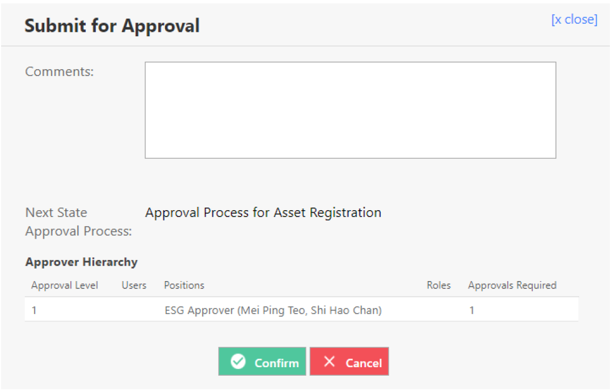

# For Asset Managers

## How do I Register an Interfaced Asset?

> Navigate to: **Asset > Asset Registration > Register Asset**

1. You will find a draft record in the **search page**. Select on the record **Draft**.

These drafts are automatically created by the system in batches from your finance system (sorted by cost centre).

2. Verify that this transaction is for interfaced assets by ensuring that **“Register Interfaced Asset”** is selected.

3. Verify that the assets should be in this batch of assets to be registered.

4. Select **Submit for Approval**.

5. Select **Confirm**.

