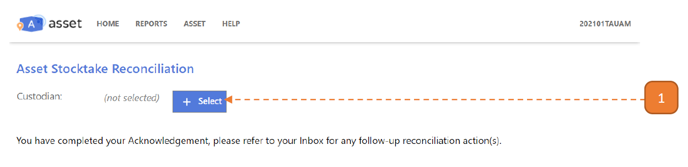
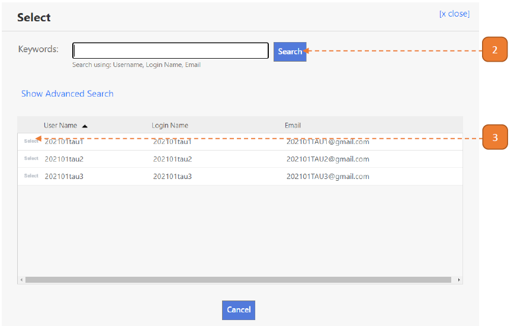
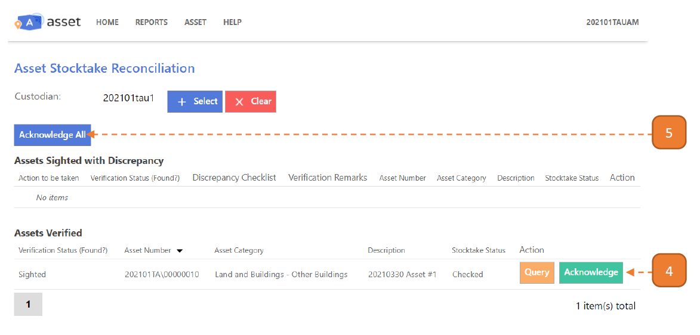

# For Asset Managers

## How do I Acknowledge the Stocktake Findings on Behalf of the Custodians?

> Navigate to: **ASSET > Asset Stocktake > Stocktake Reconciliation**.

1. Select the **Select** button.

2. Search for the Custodian.

3. Select the Custodian.

4. Select on **Query** or **Acknowledge** button found on each row. 
To acknowledge all records, **skip this step**.

5. Select **Acknowledge All** and confirm.

