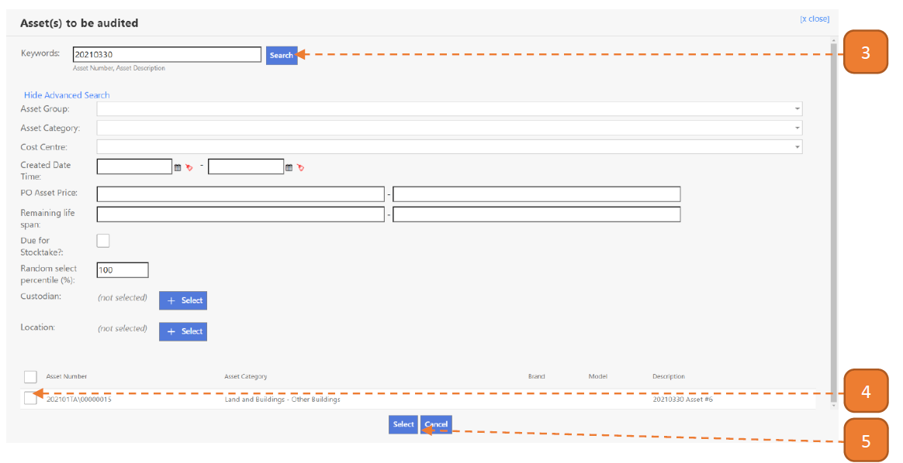

# For Asset Managers

## How do I Add an Asset During Stocktake?

> Navigate to: **Asset > Asset Stocktake > Asset Stocktake**.

1. Select the relevant transaction.

2. Select **Add**.

3. Search for the relevant Asset.

4. Check the record.

5. Select the **Select** button.

6. The new record will be appended.

7. Select **Save**.

