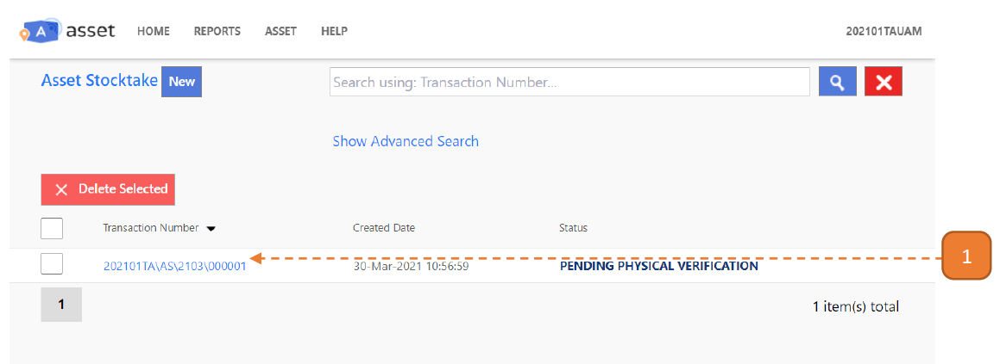
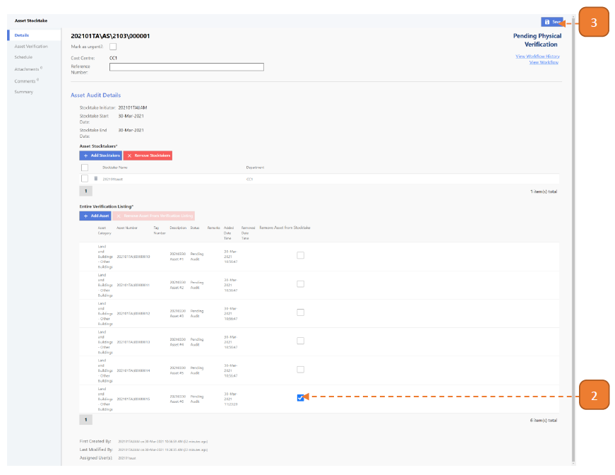

# For Asset Managers

## How do I Remove an Asset During Stocktake?

> Similarly, navigate to: **Asset > Asset Stocktake > Asset Stocktake**.

1. Select the relevant transaction.

2. Under the **“Remove Asset from Stocktake”** column, select the checkbox.

3. Select **Save**.

