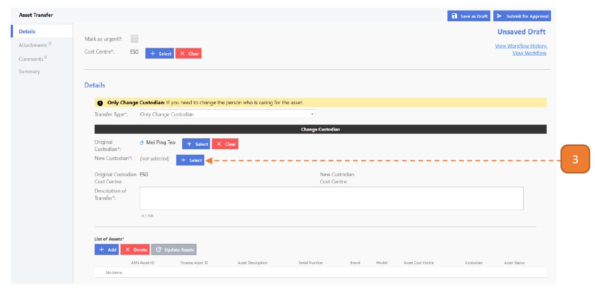
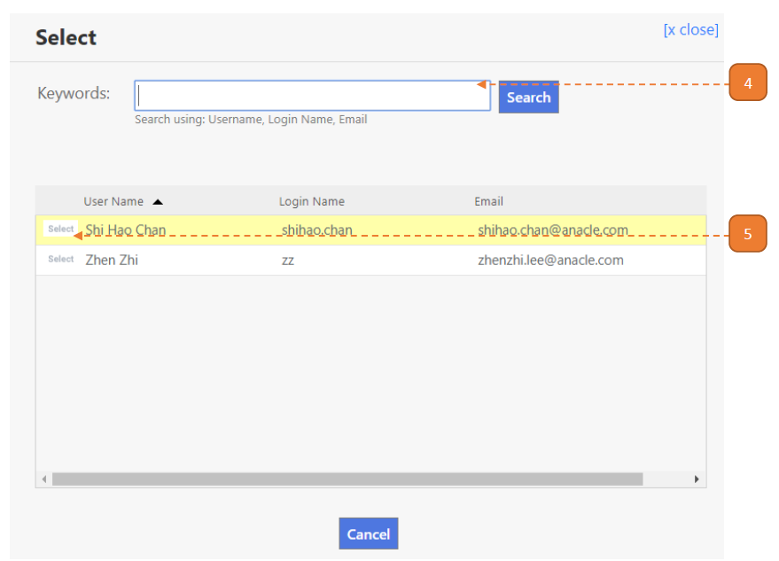
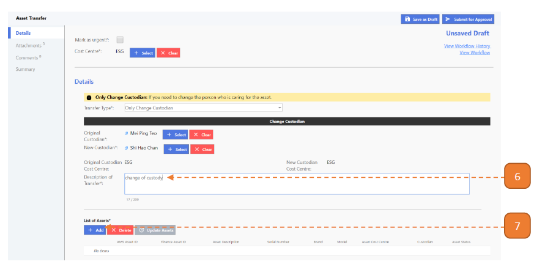
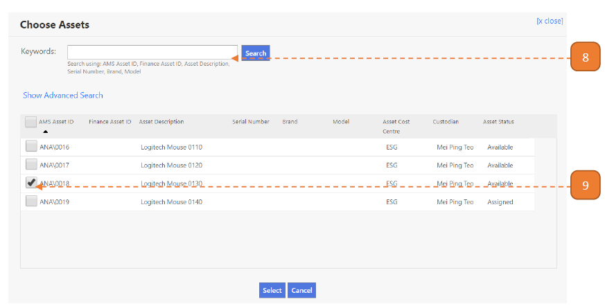
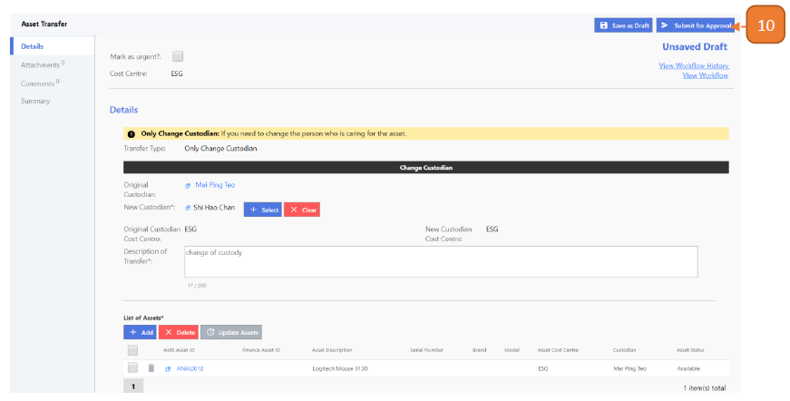
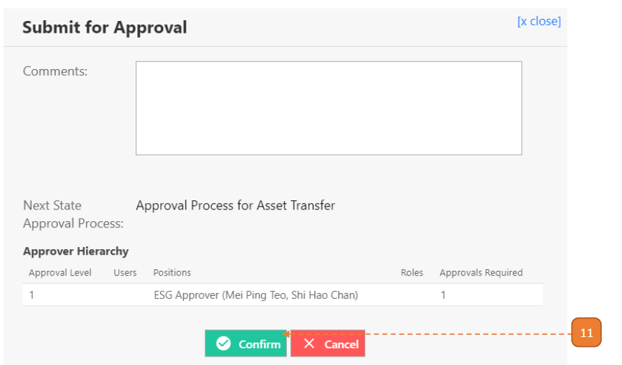
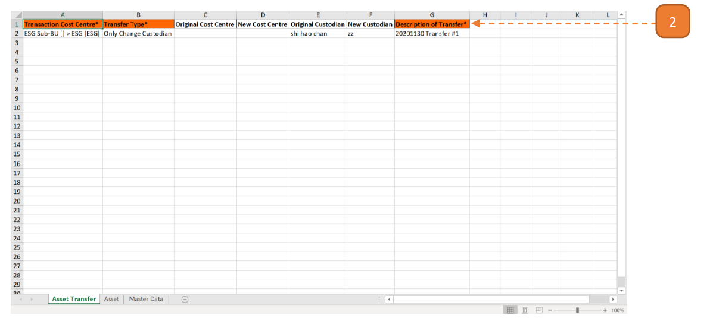
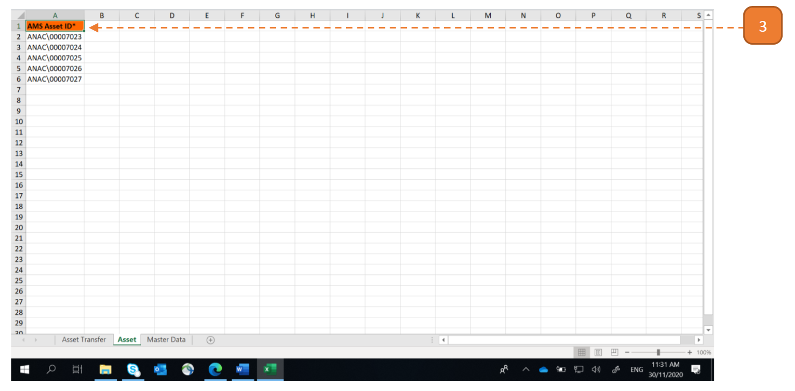

# For Custodians

## How do I Change the Asset Custody?

> Navigate to: **Asset > Asset Transfer**.

1. Select **New**.

2. Select the **Transfer Type** as “Only Change Custodian”.

3.Select the **New Custodian**.

4. Search for the user using the search box.

5. Go to the right user and select with the button, you may only select one user.

6. Enter the **Description of Transfer**.

7. Select the **List of Assets** with the **Add** button.

8. Search for the asset using the search box.

9. Check the right asset, you may select more than 1 asset.

10. Select **Submit For Approval**.

11. Select **Confirm**.

## How do I Change the Asset Custody Using Excel Upload?

1. Select **Download Upload Template File**. 
An excel workbook will be downloaded.
If the button is unavailable, notify your agency admin.

2. Open the excel workbook. 
On the **"Asset Transfer”** worksheet:

- **Transaction Cost Centre:** This is the transfer’s cost centre. 
Refer to “Master Data” worksheet for available options.

- **Transfer Type:** To transfer the asset’s custody, indicate “Only Change Custodian”.

- **Original Cost Centre:** To be left blank.

- **New Cost Centre:** To be left blank.

- **Original Custodian:** The person A **currently in charge of the asset** in the system. 
Refer to **“Master Data”** worksheet for available options.

- **New Custodian:** The person B **to-be in charge of the asset**. 
Refer to **“Master Data”** worksheet for available options.

- **Description of Transfer:** What is the description of transfer

**Note:** Only one row should be indicated.

3. On the **“Asset”** worksheet:

- **AMS Asset ID:** The ID of the asset concerning the transfer from person A to person B.

4. Browse for the workbook and select the **“Upload**.

Once the upload is confirmed, the system will check the Excel records for errors. 

When this validation is complete, a summary is shown:

5. If **no critical errors/warnings are found**, select **Confirm to Proceed**.

6. Otherwise, select **Download Validated Excel**.

- The first 2 columns on the validated worksheet will describe the critical errors/warnings that is present in the line item such as “[AMS Asset ID] cannot be found.”

7. A transaction will be created in the search page as **DRAFT**.

