# For Custodians

## How do I Update an Asset Photo via Excel Upload?

> Navigate to **Asset > Asset Update**.

1. Select **New**.

2. Select between the **Update Interfaced Asset**.

- Yes: An asset is interfaced if it’s from the finance system

- No: An asset is non-interfaced if it’s created locally

3. Select “No” for **Update for Retirement**.

4. Select the **List of Assets** with the **Add** button.

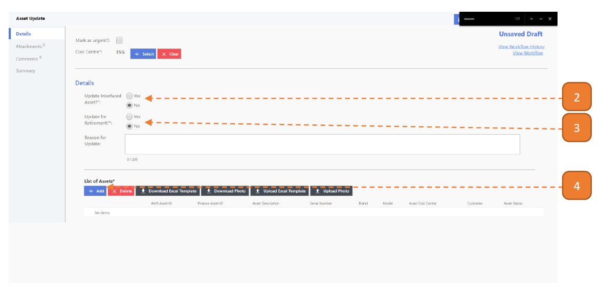

5. Search for the asset using the search box.

6. Check the right asset, you may select more than 1 asset.

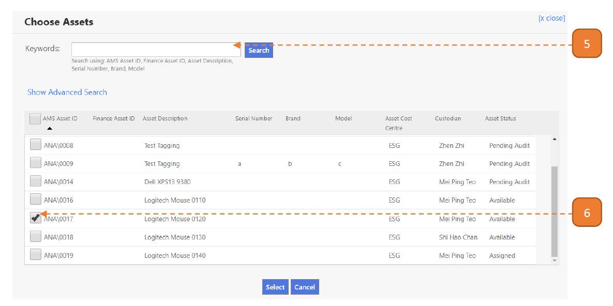

7. Select **Download Photo**.

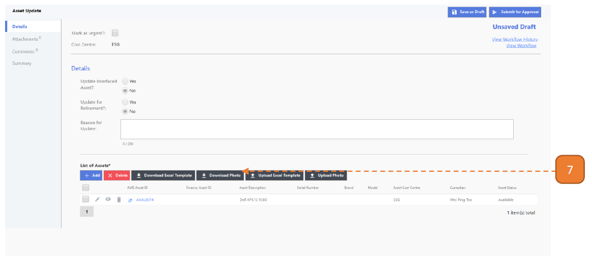

8. A zip file will be downloaded, extract the zip file.

- The folder will contain:
    - Asset photo folder (eg: ANA_0014): The folder name will correspond to the Asset ID. 
   If there are multiple assets selected for update, the corresponding number of Asset photo folders will appear.

    - Excel photo upload template (ie: Asset Update Photo Upload Template 20191203170943.xlsx)

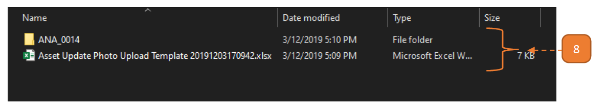

To **add photos**, skip steps 12 and 13.

To **remove photos**, skip steps 10 and 11.

To **add no photo reason**, skip steps 10, 11 and 12. 
Note that only assets without photo can have a no photo reason.

9. Open the Excel photo upload template, the worksheet entry should look like this:

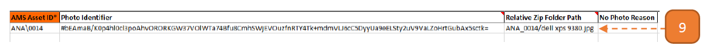

10. To add new photo, enter the entry like this:

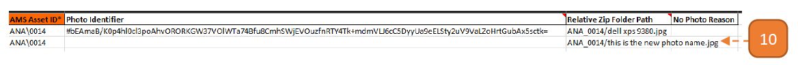

11. The corresponding image should be placed in the **Asset photo folder**.

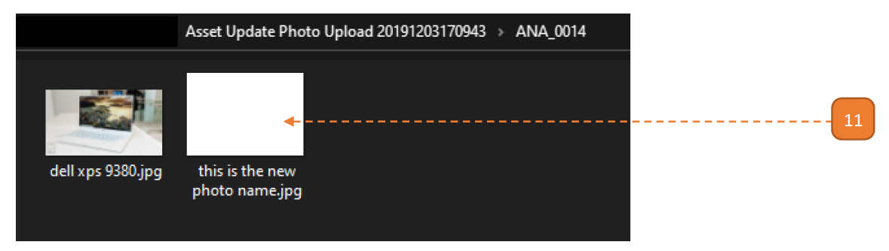

12. To remove photo, the existing entry should look like this:

- The **Relative Zip Folder Path** cell should be cleared.

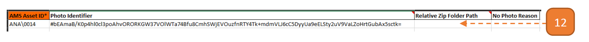

13. If the asset no longer has a photo after step 12, indicate a **"No Photo Reason"**. 

    Please refer to the **Master Data** worksheet found in the next tab for the available options for **“No Photo Reason”**.

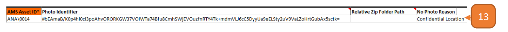

14. Save the Excel file. 
Select the list of **Asset photo folder** and **Excel photo upload template**. 
Zip the folder. 
Return to the webpage and select **Upload Excel Template**.

15. Select the **Choose File** button.

16. Select **Upload**

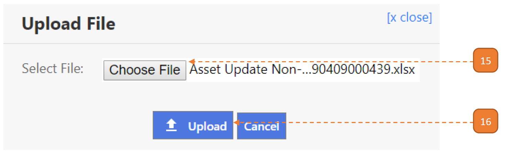

Once the upload is confirmed, the system will check the Excel records for errors. 
When this validation is complete, a summary is shown.

17. If no critical errors/warnings are found, select the **Confirm to Proceed**.

18. Otherwise, select the **Download Validated Excel**.

- The first 2 columns on the validated worksheet will describe the critical errors/warnings that is present in the line item such as “[Asset Description] cannot be found.”

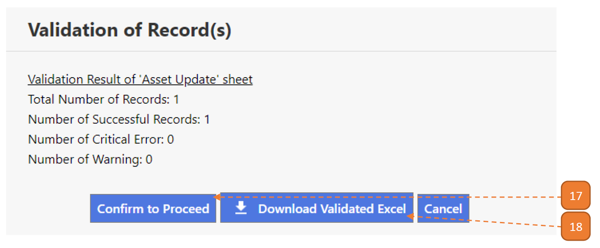

19. Select **Close**.

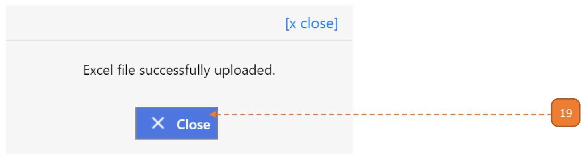

20. Verify that the asset has been uploaded.

21. Select **Submit for Approval**.

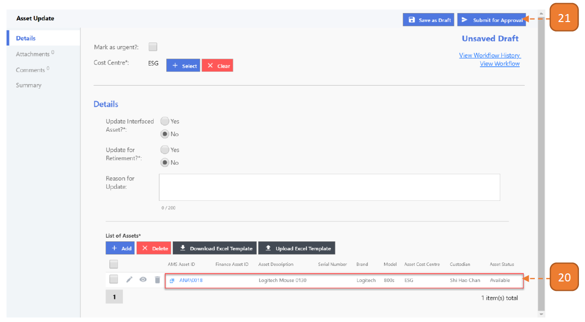

22. Select **Confirm**.

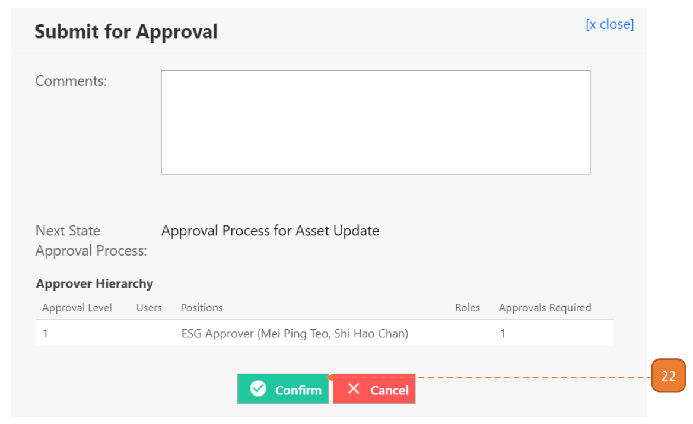