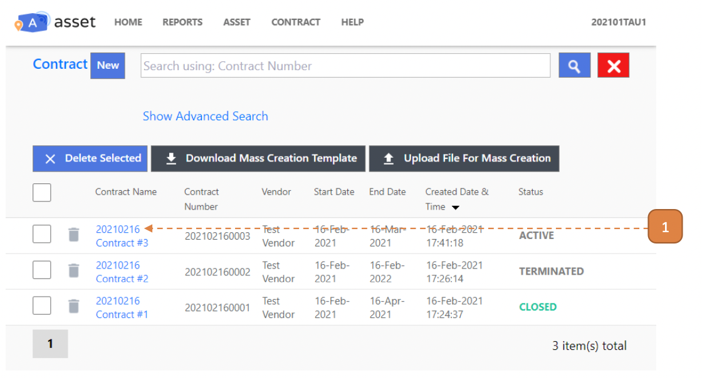
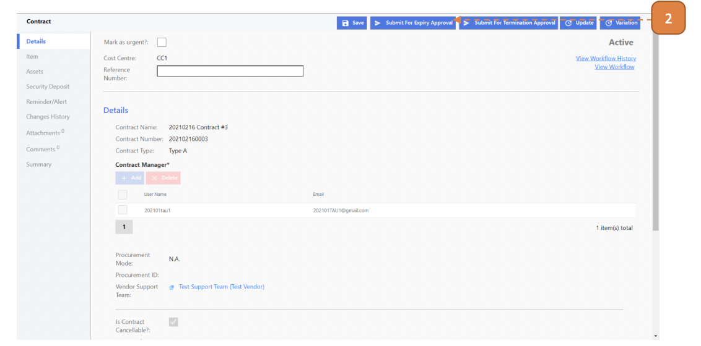

# For Contract Managers

## How do I Perform A Contract Expiry?

> Navigate to: **CONTRACT > Asset Contract**.

1. Select an existing **"ACTIVE"** contract record.

2. Select **Submit for Expiry Approval** and confirm.

