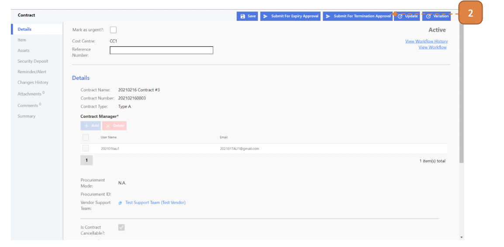

# For Contract Managers

## How do I Perform A Contract Termination?

> Navigate to: **CONTRACT > Asset Contract**.

1. Select an existing **"ACTIVE"** contract record.

2. Select **Submit for Termination Approval** and confirm.

