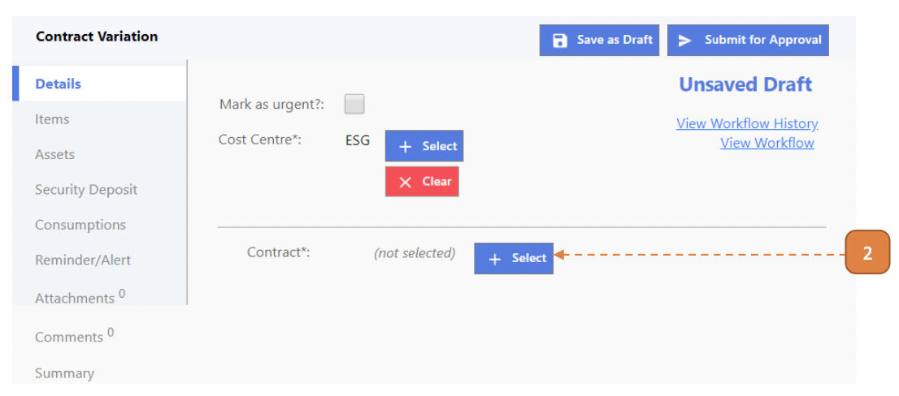
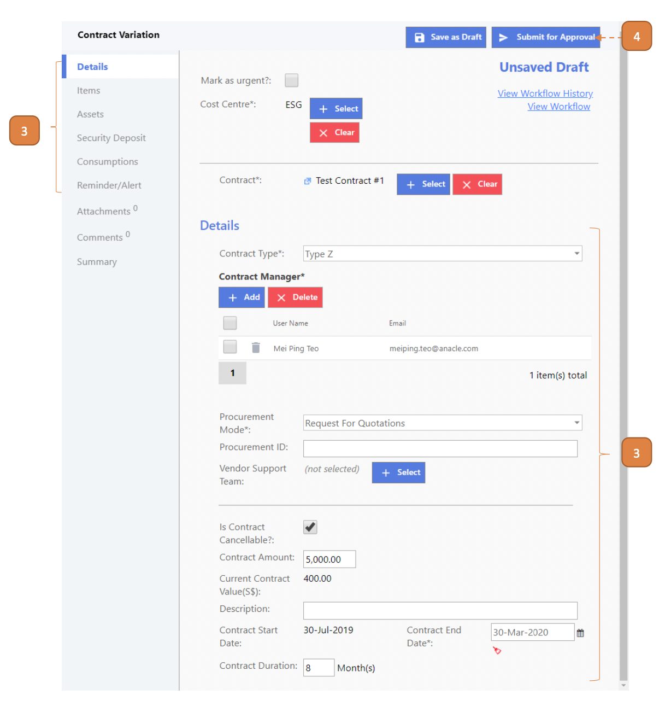

# For Contract Managers

## How do I Perform A Contract Variation?

> Navigate to: **CONTRACT > Contract Variation**.

1. Select **New**.

2. Under **Contract** label, select the **Select** button and search for the contract.

3. Edit the fields as required.

4. Select **Submit for Approval**.

