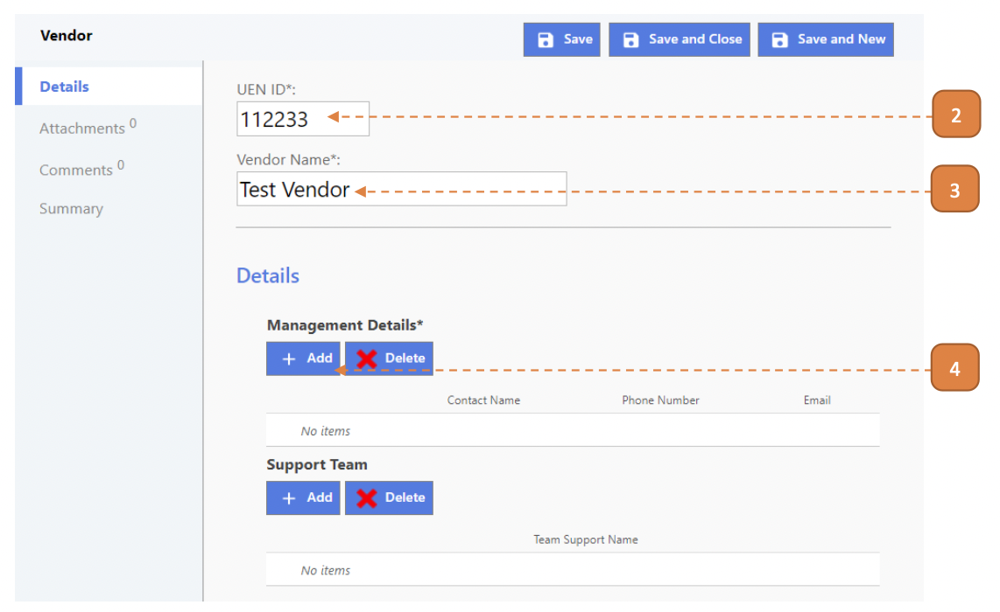
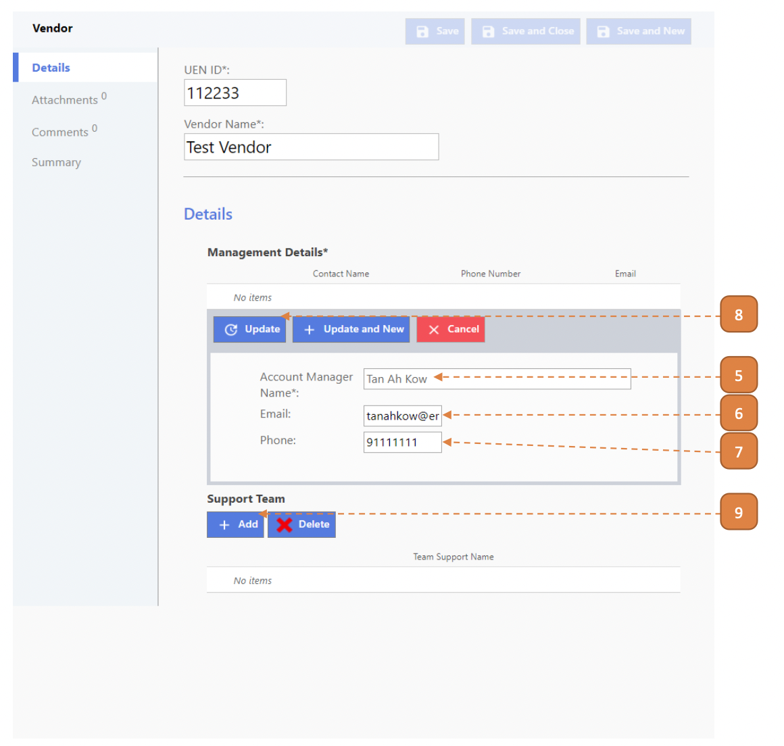
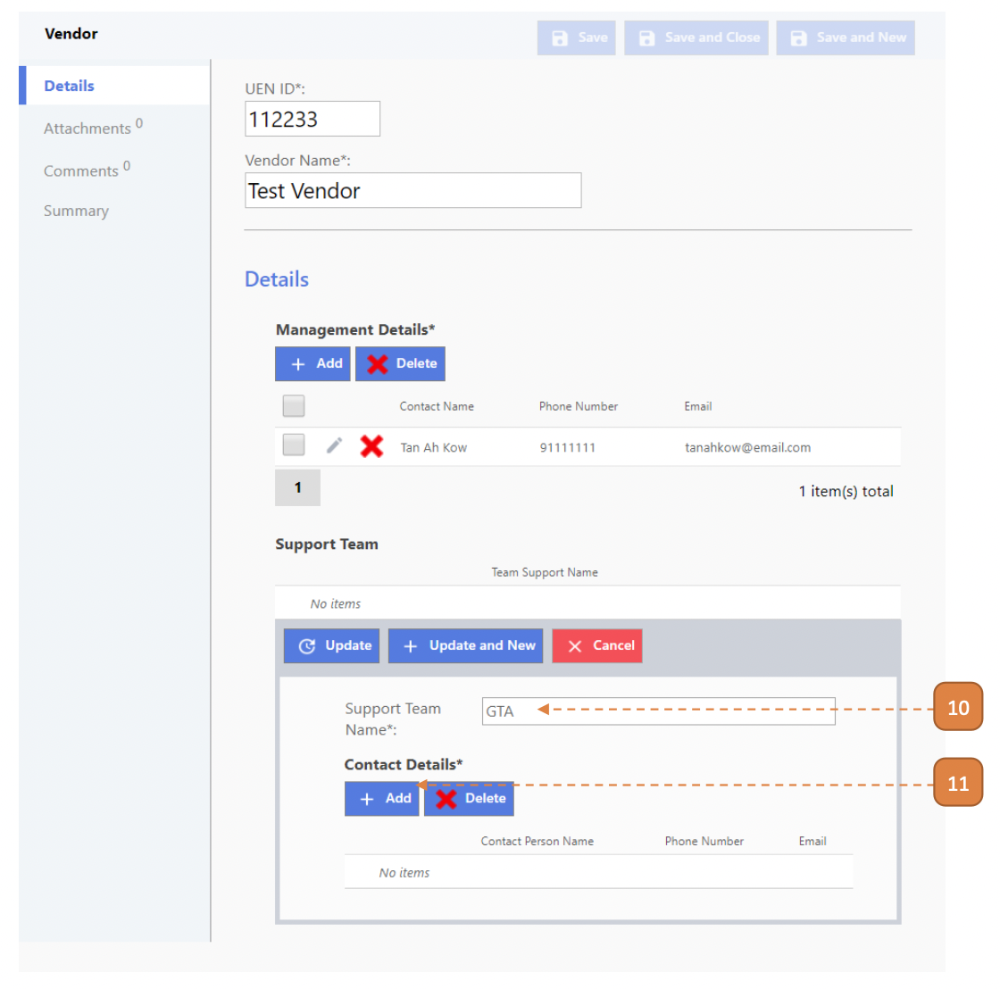
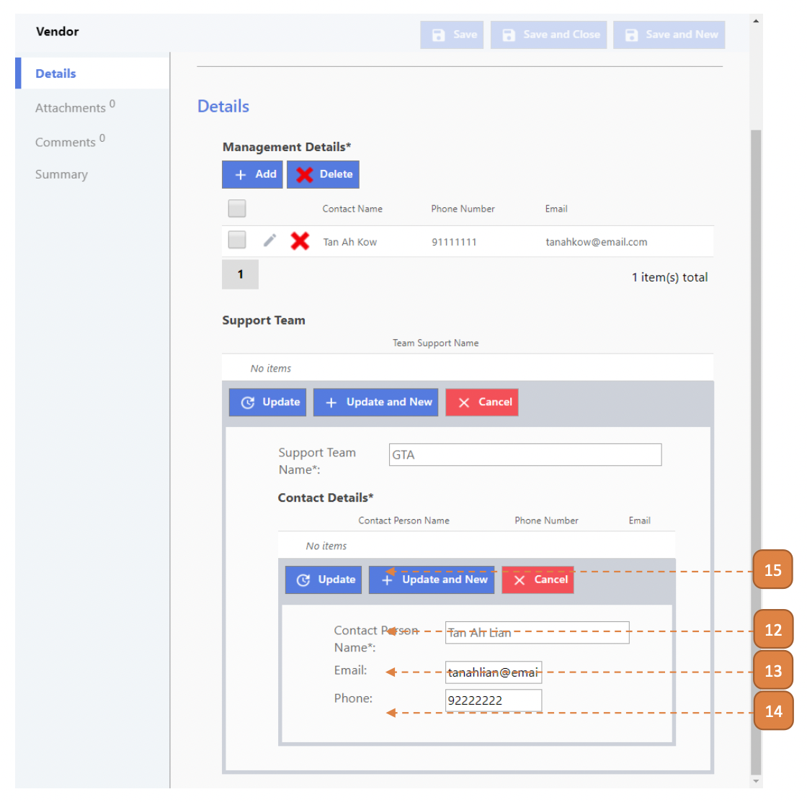
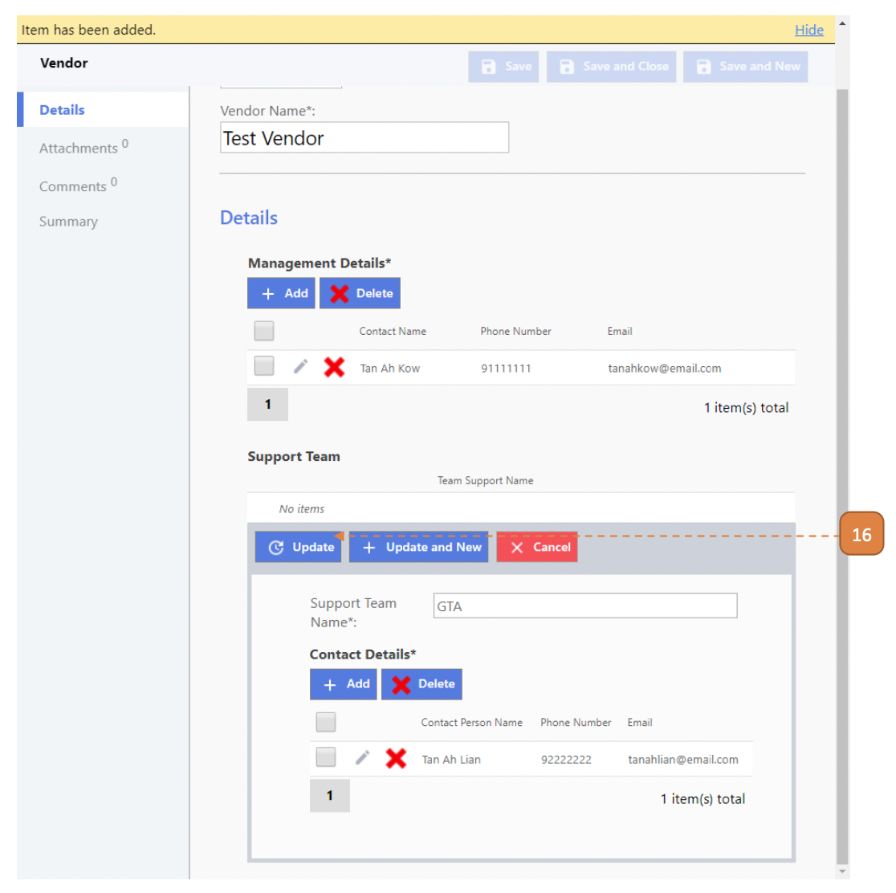
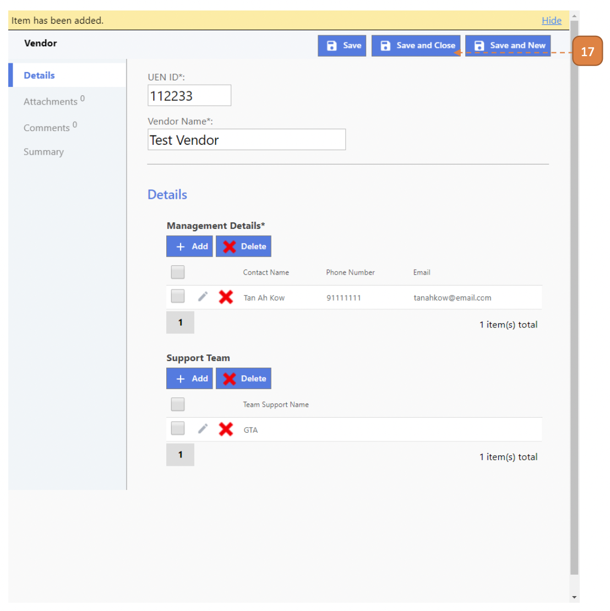

# For Contract Managers

## How do I Create A Vendor?

> Navigate to: **Contract > Vendor Listing**.

1. Select **New**.

2. Enter the **UEN ID**.

3. Enter the **Vendor Name**.

4. Select the **Add** button.

5. Enter the **Account Manager Name**.

6. Enter the **Email**.

7. Enter the **Phone**.

8. Select **Update**.

9. Select **Add**.

10. Enter the **Support Team Name**.

11. Select **Add**.

12. Enter the **Contact Person Name**.

13. Enter the **Email**.

14. Enter the **Phone**.

15. Select the **Update** button.

16. Select the **Update** button.

17. Select **Save and Close**.

