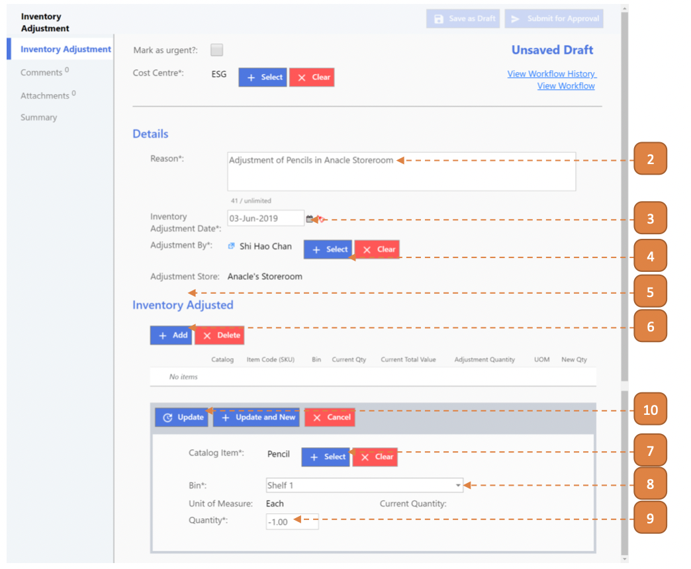
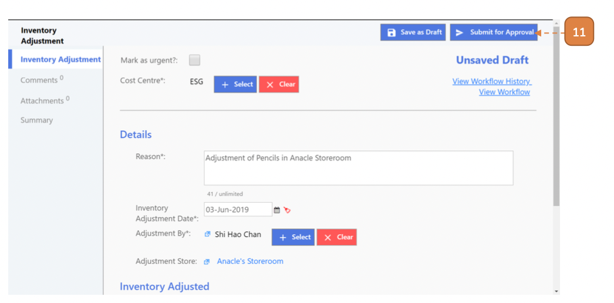

# For Inventory Admin

## How do I Adjust the Inventory in a Store?

> Navigate to: **Inventory > Inventory Adjustment**.

1. Select **New**.

2. Enter the **Reason**.

3. Select the **Inventory Adjustment Date**.

4. Select the **Adjustment By** user.

5. Select the **Adjustment Store**.

6. Under the **"Inventory Adjusted"** header, select **Add**.

7. Select the **Catalog Item**.

8. Select the **Bin**.

9. Enter the **Quantity**, number may be positive or negative.

10. Select **Update**.

11. Select **Submit for Approval**.

