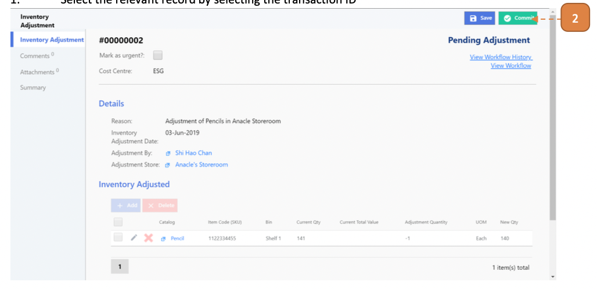

# For Inventory Admin

## How do I Commit an Inventory Adjustment to Store?

> Navigate to: **Inventory > Inventory Adjustment**.

1. Select the relevant record by selecting the Transaction ID.

2. Select **Commit**.

