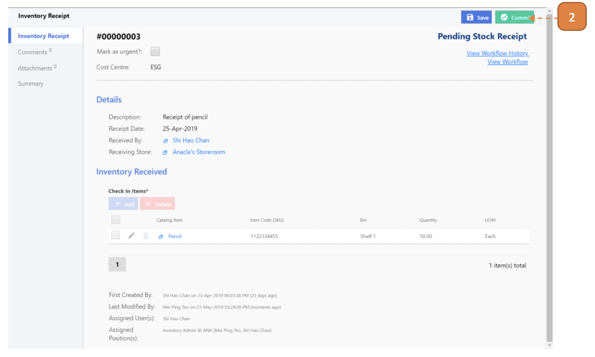

# For Inventory Admin

## How do I Commit an Inventory Receipt to Store?

> Navigate to: **Inventory > Inventory Receipt**.

1. Select the relevant record by selecting the transaction ID.

2. Select **Commit**.

