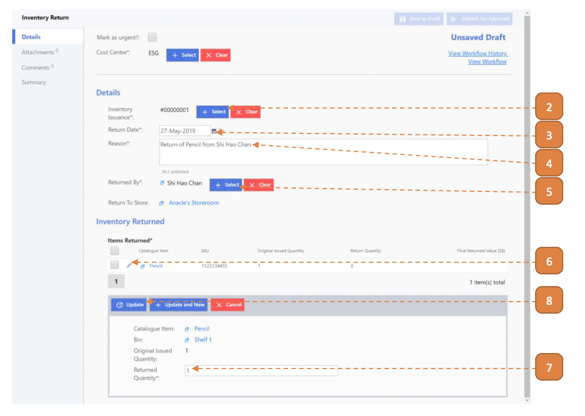
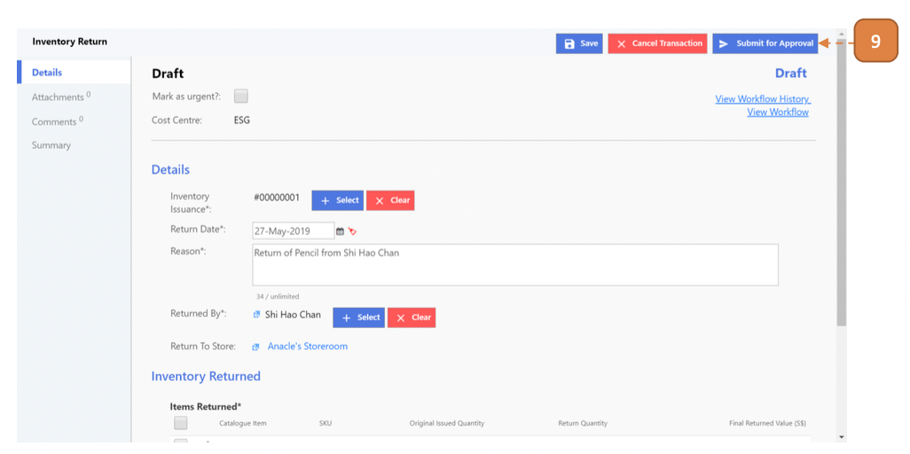

# For Inventory Admin

## How do I Raise a Return Transaction?

> Navigate to: **Inventory > Inventory Return**.

1. Select **New**

2. Select the **Inventory Issuance** transaction.

3. Select the **Return Date**.

4. Enter the **Reason** for return.

5. Select the **Returned By** person.

6. Select the **Pencil Icon** associated with the transaction.

7. Enter the **Returned Quantity**.

8. Select **Update**.

9. Select **Submit for Approval**.

10. Select **Confirm**.

