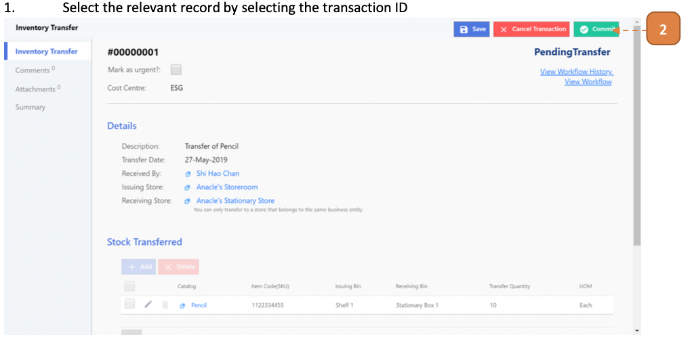

# For Inventory Admin

## How do I Commit an Inventory Issuance from Store?

> Navigate to: **Inventory > Inventory Transfer**.

1. Select the relevant record by selecting the Transaction ID.

2. Select **Commit**.

